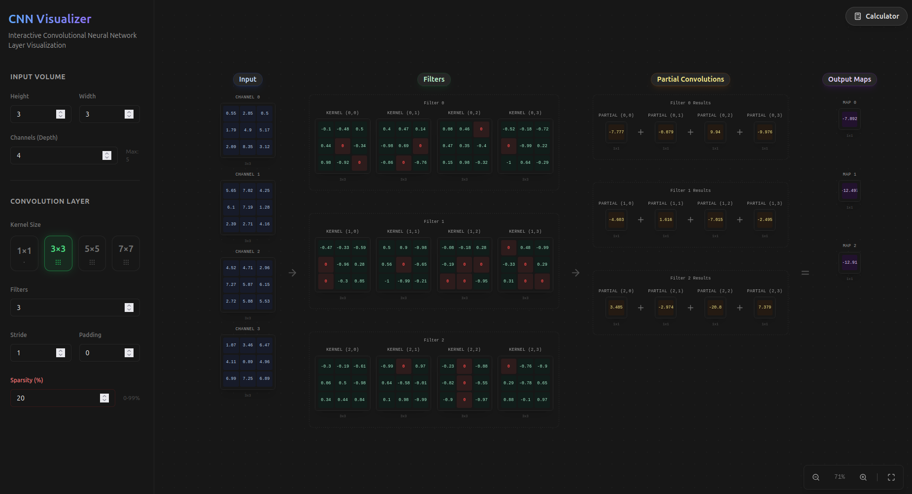

# Convolutional Neural Network (CNN) Visualizer

A web application designed to interactively visualize and calculate the mathematical operations behind Convolutional Neural Networks. Built with **Django** (backend) and **React + Vite** (frontend).



## 🌟 Key Features

### 🧠 Interactive Visualization
- **Infinite Canvas**: A drag-and-drop "infinite" board that lets you navigate large neural network layers with ease.
- **Smart Zoom**:
    - **Cursor-Centered Zoom**: Hold `Ctrl` + `Scroll` (or `Cmd` + `Scroll`) to zoom exactly where you are looking.
    - **Physical Panning**: Drag the board to move around like a physical map.
    - **Auto Fit**: Instantly center and scale the visualization to fit your screen.
- **Real-Time Convolution**: Watch as kernels slide over input matrices to produce output feature maps.

### 🧮 Operations Calculator
A built-in tool to estimate the computational cost of a convolutional layer.
- **Input Parameters**: Configure Input Dimensions ($H \times W \times C$), Kernel Size ($K$), Stride ($S$), Padding ($P$), and Number of Filters ($F$).
- **Complexity Analysis**:
    - **FLOPs Estimation**: Calculates Total Multiplications, Additions, and total Floating Point Operations.
    - **Breakdown**: Detailed view of Intra-Kernel Sums vs. Channel Merges vs. Bias Adds.
- **Sparsity Impact**: Simulate weight sparsity (e.g., pruning) to see how many operations can be skipped (Zero Ops).

### ⚡ Performance & Design
- **High Performance**: Optimized using `React.memo` and render virtualization to handle large matrices at 60 FPS.
- **UI**: Designed with `Shadcn/UI` and `TailwindCSS` for a modern, accessible dark-mode experience.
- **Persistence**: Your configuration is automatically saved to Local Storage.

---

## 🛠️ Tech Stack

### Frontend
-   **Framework**: React 18 + Vite
-   **Styling**: TailwindCSS
-   **Components**: Shadcn/UI + Radix Primitives
-   **Animations**: Framer Motion
-   **Icons**: Lucide React

### Backend
-   **Framework**: Django (Python)
-   **API**: RESTful architecture
-   **CORS**: Configured for seamless cross-origin requests

---

## 🚀 How to Run

You will need two terminal windows to run the application (one for the backend and one for the frontend).

### Prerequisites
-   Python 3.8+
-   Node.js & npm

### Terminal 1: Backend Setup
1.  **Create a virtual environment** (recommended):
    ```bash
    # Linux/Mac
    python3 -m venv venv
    source venv/bin/activate
    
    # Windows
    # python -m venv venv
    # venv\Scripts\activate
    ```
2.  **Install dependencies**:
    ```bash
    pip install -r requirements.txt
    ```
3.  **Run the development server**:
    ```bash
    python backend/manage.py runserver
    ```

### Terminal 2: Frontend Setup
1.  Navigate to the frontend directory:
    ```bash
    cd frontend
    ```
2.  Install dependencies:
    ```bash
    npm install
    ```
3.  Start the development server:
    ```bash
    npm run dev
    ```
4.  Open [http://localhost:5173](http://localhost:5173) in your browser.

---

## 📖 User Guide

### 1. The Visualizer Board
This is the main workspace where the magic happens.
-   **Left Panel (Config)**: Set your Key Parameters here.
    -   **Input Size**: Adjust the height/width of the input image.
    -   **Kernels/Filters**: Add or remove filters and change their values.
    -   **Padding**: Add padding zeros around the input.
-   **The Canvas**:
    -   **Pan**: Click and drag anywhere on the background.
    -   **Zoom**: Use `Ctrl + Scroll` or the floating `+` / `-` buttons.
    -   **Reset**: Click the corner `Maximize` icon to auto-fit the diagram.

### 2. The Operations Calculator
Click the **Calculator** icon in the top-right corner to open the standalone calculator.
Use this to plan your network architecture constraints.
-   Enter your layer hyperparameters.
-   Review the total **FLOPs** to check if the layer is too computationally expensive.
-   Adjust **Sparsity** to see potential performance gains from pruning.

---

## 📂 Project Structure

```
├── backend/               # Django project root
│   ├── core/              # Main app configuration
│   └── manage.py          # Django CLI
├── frontend/              # React application
│   ├── src/
│   │   ├── components/
│   │   │   ├── calculator/ # Operations Calculator
│   │   │   ├── config/     # Configuration Sidebar
│   │   │   ├── visualizer/ # Visualizer Components (Board, Grid)
│   │   │   └── ui/         # Reusable UI components
│   │   ├── logic/          # Math convolution algorithms
│   │   └── hooks/          # Application state logic
│   └── vite.config.ts      # Vite configuration
└── README.md
```

---

## 🤝 Contributing
Contributions are welcome! Please feel free to submit a Pull Request.

1.  Fork the project
2.  Create your feature branch (`git checkout -b feature/AmazingFeature`)
3.  Commit your changes (`git commit -m 'Add some AmazingFeature'`)
4.  Push to the branch (`git push origin feature/AmazingFeature`)
5.  Open a Pull Request
